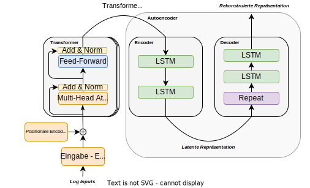

# BERT-AE
Implementation of a Transformer based Approach to
Anomaly-Detection in system logs.

## Description




## Setup
### Project Dependencies
Management of project dependencies is done with [Poetry](https://python-poetry.org/). Installation of dependencies is done with

```sh
poetry install
```
To activate the environment, use:
```shell
poetry shell
```
If an CUDA-GPU is available on the system replace following lines in `pyproject.toml`

```toml
[tool.poetry.dependencies]
torch = { version = "^2.0.1", source = "torch-cpu" }
[tool.poetry.source]
name = "torch-cpu"
url = "https://download.pytorch.org/whl/cpu"
priority = "explicit"
```
with 
```toml
[tool.poetry.dependencies]
torch = "^2.0.1"
```
### Dataset
The evaluation is done on the [HDFS Log Dataset](https://github.com/logpai/loghub/tree/master/HDFS#hdfs_v1). The dataset can be retrieved with the script `fetch_hdfs.sh` via
```shell
./HDFS/fetch_hdfs.sh
```
Beforehand you might want to make the script executable with 
```shell
chmod 777 ./HDFS/fetch_data.sh
```
We apply LogParsing using the Drain3 Parser to bring the log data into a processable form. To do so, following commands from
project root are necessary:
```shell
cd ./hdfs
python3 preprocess.py
```


## Evaluation
### Experiment Tracking
The capturing of Evaluation Metrics/Performance is done through a [PyTorch Lightning](https://lightning.ai/docs/pytorch/stable/). The Script currently uses the MLflow Experiment Tracker to track metrics. A local MLflow instance can be [setup reasonably fast](https://mlflow.org/docs/latest/quickstart.html). 

If you want to change the used Logger, you can switch out the used `MLFlowLogger` objects in `./HDFS/BERT-AE/training.py` to one of Lightnings [other loggers implementations](https://lightning.ai/docs/pytorch/stable/api_references.html#loggers).
```python
logger = MLFlowLogger(experiment_name=ae_trainer_config.experiment_name,
                      run_name=f"{run_name}",
                      log_model=True)
```
To access the logged models, just start the `MLFlow Server` with
```shell
poetry shell
mlflow server
```
To server should be available under http://127.0.0.1:5000
### Training
The training of the models is done through the `training.py` script
under their respective directories. 
The scripts should be called from project root.

The hyperparameters of the models are documented in a separate README in their respective directories.